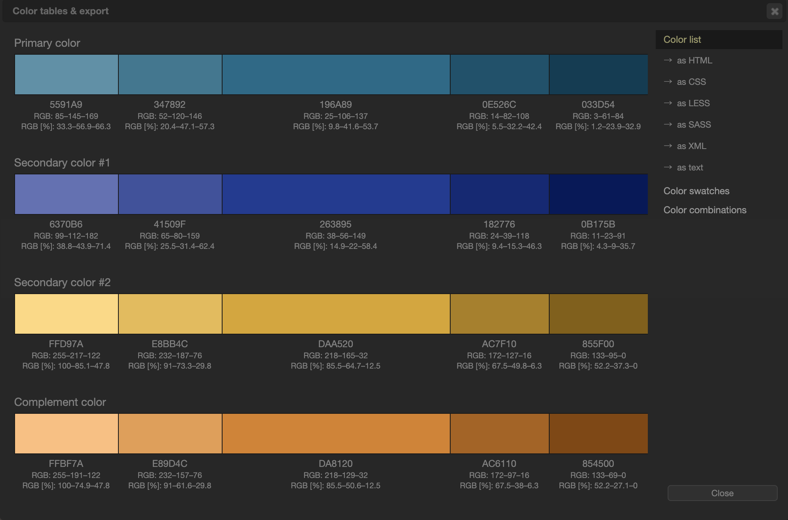

# 概要

このブログを作成するときに、参考にした文献や Web サイトをまとめたいと思います。

## Web ページの配色決め

以下の**Paletton**という配色サイトを利用しました。  
<https://paletton.com>

このブログの基本色を`#196989`と決めて、以下のように自分のイメージとマッチする配色を決めます。  
<https://paletton.com/#uid=73q0u0krirpgEyVlztat6lCyGgJ>

配色のリストを以下のように、出すこともできます。

## 画像ファイルの圧縮

画像の圧縮には、**Compressor.io**というサイトを利用しました。  
<https://compressor.io/>

## テキスト間の高さを設定する

CSS line-height の書き方３つを初心者向けに図で解説！  
<https://udemy.benesse.co.jp/development/web/line-height.html>

## 文字詰めのテクニック

文字詰めできる CSS の font-feature-settings が凄い！
日本語フォントこそ指定したい自動カーニング  
<https://ics.media/entry/14087/>

## Gatsby を使ってブログを作る際に参考になったサイト

ReactGO - Build an advanced blog using gatsby and react  
<https://reactgo.com/gatsby-advanced-blog-tutorial>

## サイドバーを固定する

CSS だけでサイドバーを固定・スクロール追従する方法（JavaScript 不要）  
<https://tech-dig.jp/css%E3%81%A0%E3%81%91%E3%81%A7%E3%82%B5%E3%82%A4%E3%83%89%E3%83%90%E3%83%BC%E3%82%92%E5%9B%BA%E5%AE%9A%E3%83%BB%E3%82%B9%E3%82%AF%E3%83%AD%E3%83%BC%E3%83%AB%E3%81%AB%E8%BF%BD%E5%BE%93%E3%81%99/>
