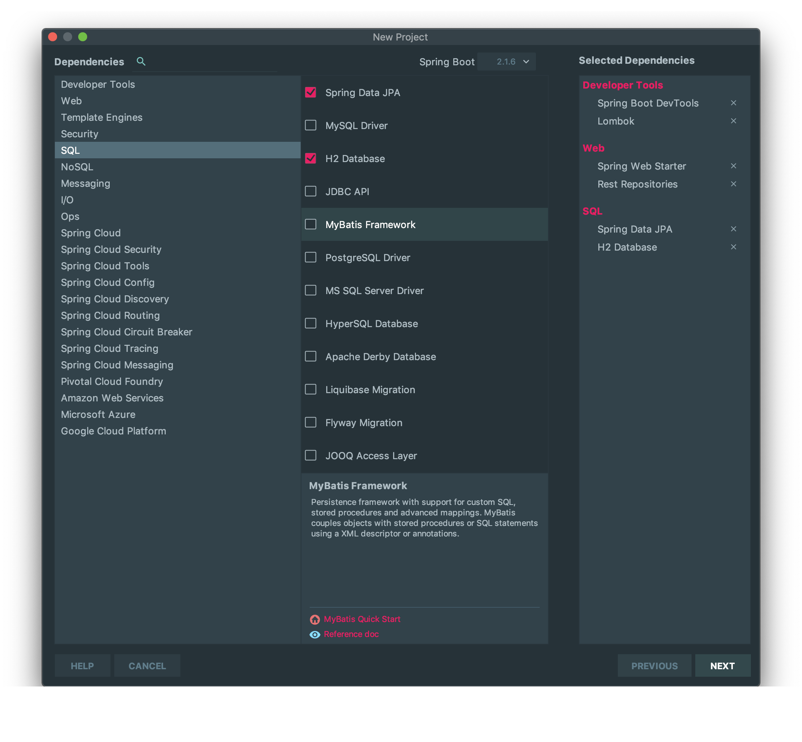

## Creating the Backend Application using Spring Boot

Let's create the new project using Spring Initialzr on InteliJ IDEA.

1. Select **Spring Boot DevTools**, **Lombok**, **Spring Web Starter**, **Rest Repositories**, **Spring Data JPA**, **H2 Database** dependencies from the Dependencies section.
2.

