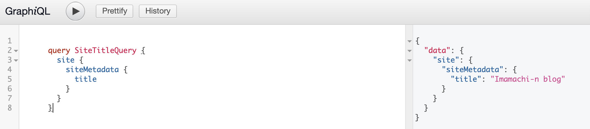

## CSS リセット

```bash
yarn add minireset.css
```

## Gatsby typography プラグインを導入する

`gatsby-plugin-typography`を使うことでフォントの設定をすることができます。

```bash
yarn add gatsby-plugin-typography react-typography typography typography-theme-wordpress-2016
```

## emotion

CSS-in-JS のライブラリ。JavaScript のコードの中に、CSS の定義を埋め込む形式。高いパフォーマンス。コードの可読性は悪くなる？

Gatsby 用のプラグインがあるので、導入する必要があります（逆に、プラグインを導入しないと Emotion の CSS の定義が適応されないので注意です）。  
<https://www.gatsbyjs.org/docs/emotion/>  
<https://emotion.sh/>

```bash
yarn add gatsby-plugin-emotion @emotion/core
```

`gatsby-config.js`に次のコードを追加します。

```javascript
module.exports = {
  plugins: [`gatsby-plugin-emotion`],
}
```

## StaticQuery

Gatsby v2 から導入された新しい API。Page コンポーネントで使われている GraphQL タグは、Page コンポーネント以外では使用できませんでした。v2 から導入された StaticQuery を利用することで、Layout コンポーネントのように、Page コンポーネントでないコンポーネントでも GraphQL が利用できるようになります。

以下に具体例を示す。

```javascript
import React from "react"
import { StaticQuery, graphql } from "gatsby"

export default () => (
  <StaticQuery
    query={graphql`
      query HeadingQuery {
        site {
          siteMetadata {
            title
          }
        }
      }
    `}
    render={data => (
      <header>
        <h1>{data.site.siteMetadata.title}</h1>
      </header>
    )}
  />
)
```

`gatsby-config.js`ファイルに以下の内容が記載されている場合を想定します。

```javascript
module.exports = {
  siteMetadata: {
    title: `Imamachi-n blog`,
  },
}
```

`gatsby develop`コマンドを実行後、`http://localhost:8000/___graphql`の URL にアクセスし、以下のクエリを実行してみます。

```graphql
query HeadingQuery {
  site {
    siteMetadata {
      title
    }
  }
}
```

すると、以下の結果が得られるはずです。

```graphql
{
  "data": {
    "site": {
      "siteMetadata": {
        "title": "Imamachi-n blog"
      }
    }
  }
}
```



## Meta タグを追加する

### react-helmet を使う

`gatsby-plugin-react-helmet`プラグインを導入します。

```bash
yarn add react-helmet gatsby-plugin-react-helmet
```

`gatsby-config.js`に次のコードを追加します。

```javascript
module.exports = {
  plugins: [`gatsby-plugin-react-helmet`],
}
```

`<Helmet>`タグを使って、Meta タグを組み込みます。以下の例では、ページのタイトルを設定しています。

```js
import { Helmet } from "react-helmet"

export default () => {
  ;<>
    <Helmet>
      <title>{post.frontmatter.title}</title>
    </Helmet>
    ...
  </>
}
```

## Markdown ファイルを HTML ファイルに変換する

`gatsby-transformer-remark`プラグインを導入します。

```bash
yarn add gatsby-transformer-remark
```

`gatsby-config.js`に次のコードを追加します。

```javascript
module.exports = {
  plugins: [`gatsby-transformer-remark`],
}
```

プラグインを導入することで、GraqhQL から Markdown ファイルを検索して調べる事ができるようになります。

```graphql
export const query = graphql`
  query {
    allMarkdownRemark(sort: { fields: [frontmatter___date], order: DESC }) {
      totalCount
      edges {
        node {
          id
          frontmatter {
            title
            date(formatString: "DD MMMM, YYYY")
          }
          fields {
            slug
          }
          excerpt
        }
      }
    }
  }
`
```

## Markdown ファイル内の Image ファイルを表示する

Markdown ファイル内で指定された画像ファイルは、`gatsby-transformer-remark`プラグインだけでは表示されません。
`gatsby-remark-images`プラグインを導入することで読み込めるようにします。
<https://www.gatsbyjs.org/packages/gatsby-remark-images/>

まず、ライブラリをインストールします。

```bash
yarn add gatsby-remark-images gatsby-plugin-sharp
```

`gatsby-config.js`ファイル内で以下を設定します。
`maxWidth`は表示する画像ファイルの最大幅を指定します。

ちなみに対応している Image ファイルのフォーマットは

- JPEG
- PNG

だけなので、注意です。

```javascript
// In your gatsby-config.js
plugins: [
  `gatsby-plugin-sharp`,
  {
    resolve: `gatsby-transformer-remark`,
    options: {
      plugins: [
        {
          resolve: `gatsby-remark-images`,
          options: {
            // It's important to specify the maxWidth (in pixels) of
            // the content container as this plugin uses this as the
            // base for generating different widths of each image.
            maxWidth: 590,
          },
        },
      ],
    },
  },
]
```

## Markdown ファイルの見出しを生成する

prismjs の後に宣言する必要がある。  
<https://www.gatsbyjs.org/packages/gatsby-remark-autolink-headers/>

```bash
yarn add gatsby-remark-autolink-headers
```

## シンタックスハイライトをつける

Markdown ファイルのソースコード部分に、シンタックスハイライトをつけることができます。  
<https://www.gatsbyjs.org/packages/gatsby-remark-prismjs/>

まずは、こちらの PrismJS の公式サイトから、プレビューを見て好みのテーマを探しましょう。  
<https://prismjs.com/>

続いて、好きなテーマを導入してみましょう。以下で、各テーマの CSS ファイル名がわかるので確認しておきます。  
<https://github.com/PrismJS/prism/tree/1d5047df37aacc900f8270b1c6215028f6988eb1/themes>

```bash
yarn add gatsby-remark-prismjs prismjs
```

`gatsby-browser.js`に以下を追加しましょう。ここでは、`TOMORROW NIGHT`を使ってみます。

```js
require("prismjs/themes/prism-tomorrow.css")
```

## コードタイトルを追加する

```bash
yarn add -D gatsby-remark-code-titles
```

## GraphQL

### ブログの目次を作る

`value`が目次、`depth`は見出しの大きさ（H1, H2, H3 とか）のこと。

```graphql
{
  markdownRemark(fields: { slug: { eq: "/2019/first-post/" } }) {
    id
    headings {
      value
      depth
    }
    fields {
      slug
    }
  }
}
```

```json
{
  "data": {
    "markdownRemark": {
      "id": "ff34f383-8e24-57c0-a39a-488a2dba24e9",
      "headings": [
        {
          "value": "Gatsby typographyプラグインを導入する",
          "depth": 2
        },
        {
          "value": "emotion",
          "depth": 2
        },
        {
          "value": "StaticQuery",
          "depth": 2
        },
        {
          "value": "MarkdownファイルをHTMLファイルに変換する",
          "depth": 2
        },
        {
          "value": "Markdownファイル内のImageファイルを表示する",
          "depth": 2
        },
        {
          "value": "Markdownファイルの見出しを生成する",
          "depth": 2
        },
        {
          "value": "シンタックスハイライトをつける",
          "depth": 2
        },
        {
          "value": "コードタイトルを追加する",
          "depth": 2
        },
        {
          "value": "GraphQL",
          "depth": 2
        },
        {
          "value": "ブログの目次を作る",
          "depth": 3
        }
      ],
      "fields": {
        "slug": "/2019/first-post/"
      }
    }
  }
}
```

```js
<ul>
  {headerList.map(({ value, link, depth }, index) => (
    <li
      key={index}
      css={css`
        margin-left: ${(depth - 2) * 12}px;
        &:hover {
          border-radius: 5px;
          background-color: lightyellow;
        }
      `}
    >
      <Link to={`${blogLink}#${link}`}>{value}</Link>
      {/* <small>{depth}</small> */}
    </li>
  ))}
</ul>
```

### スクロールに合わせて目次を追従させる

```bash
yarn add lodash
```

## GraphQL でブログの前後のページを取得

```graphql
{
  allMarkdownRemark(sort: { fields: [frontmatter___date], order: DESC }) {
    totalCount
    edges {
      prev {
        frontmatter {
          title
        }
      }
      next {
        frontmatter {
          title
        }
      }
      node {
        id
        frontmatter {
          title
          date: date(formatString: "MM/DD")
          year: date(formatString: "YYYY")
          tagsfta
        }
        fields {
          slug
        }
        excerpt
      }
    }
  }
}
```

Array オブジェクトからフィルタリングする場合

```graphql
 allMarkdownRemark(
      limit: 1000,
      filter: {frontmatter: { tags: { in: ["emotion"] } } },
      sort: { fields: [frontmatter___date], order: DESC }
    ) {
      edges {
        node {
          fields {
            slug
          }
          frontmatter{
            tags
          }
        }
      }
  }
```

## SNS のシェアボタンを用意する

```bash
yarn add react-share
```

<https://swas.io/blog/social-share-button-for-gatsby-blog-pages/>

## FontAwesome を使う

```bash
yarn add @fortawesome/fontawesome-svg-core @fortawesome/free-solid-svg-icons @fortawesome/react-fontawesome @fortawesome/free-brands-svg-icons
```
